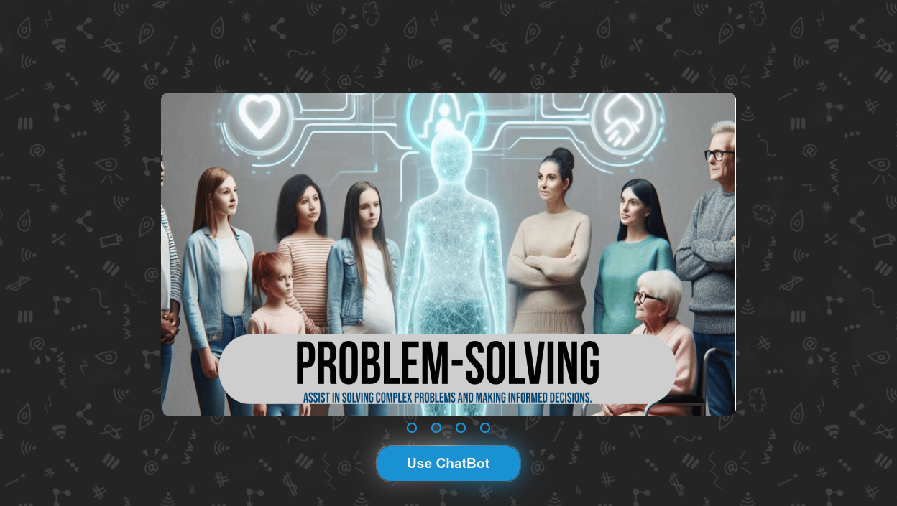
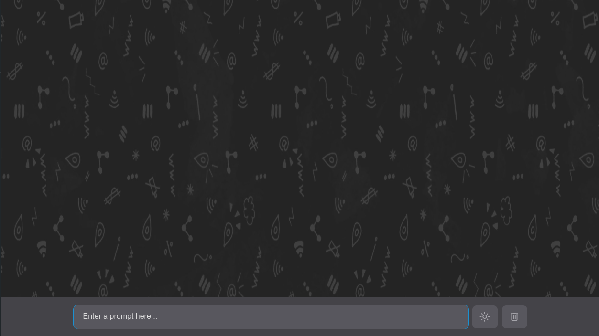
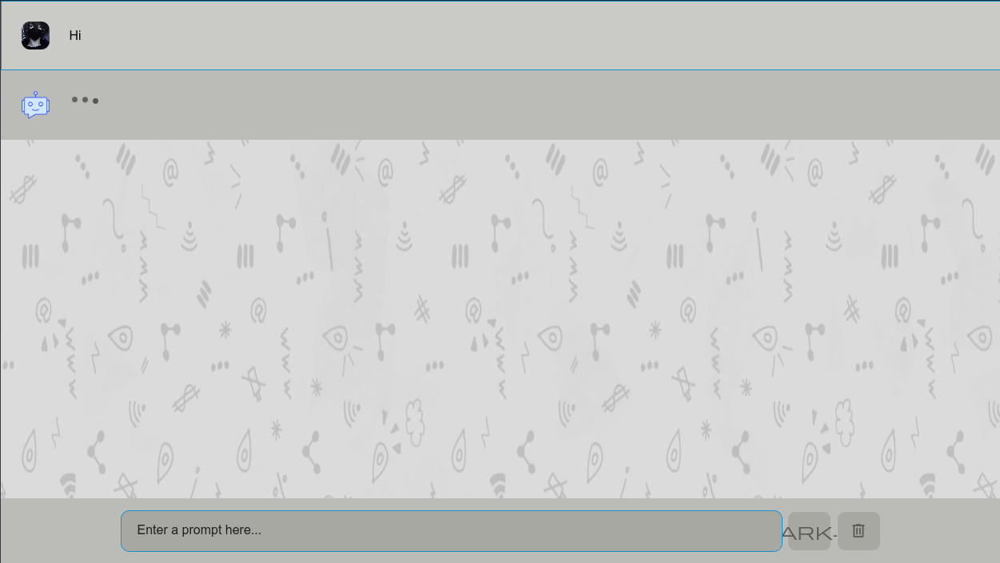

# ChatGPT Clone Site
### by Alex, Atiloye, Faith, Jamiu and Angela.
---

### The challenge

In this solution, the user should be able to:

- Safely move from a slideshow landing page to the main chat container,
- Communicate with an AI bot,
- Toggle between light and dark mode,
- View the optimal layout for the interface depending on their device's screen size (Web and Mobile),
- See hover and focus states for all interactive elements on the page,
- Delete chat history.
---
### Screenshots

---
### Links

- Solution URL: [GitHub Repo](https://github.com/thecynic101/chatGPT-clone/tree/faith)
- Live Site URL: [GitHub live site URL]()

---
## My process

### Built with

- Semantic HTML5 markup
- CSS custom properties
- Flexbox
- CSS Grid
- Vanilla JS
- OpenAI AI API
---
### What we learnt

- How to work with sliders,
- Working with custom HTML tags,
- Setting a light and dark mode,
- Integrating APIs into a project,
- Improved JS knowledge and DOM manipulation,
- Debugging...lots and lots of debugging.
